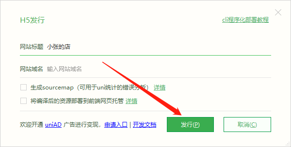
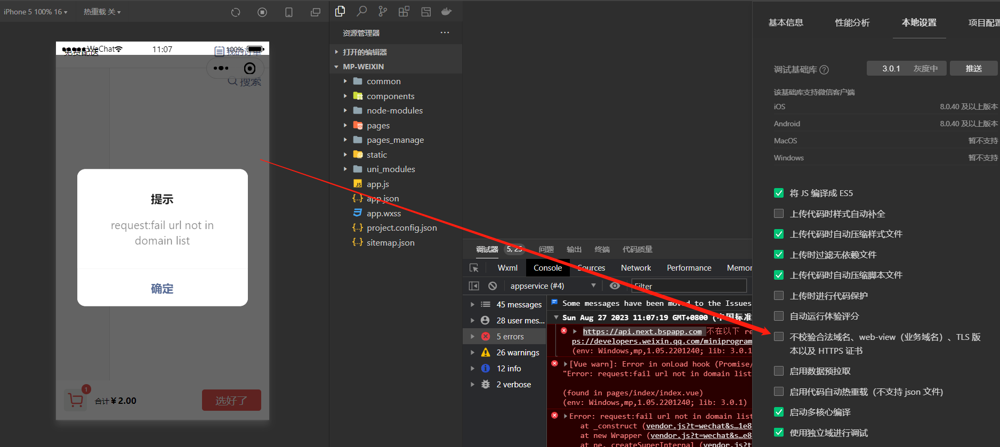

# myshop
## 这个是基于课程商城，二开项目，有兴趣了解细节的可以关注一波原创作者，制作不易希望大家多多支持。

[原作者CSDN](https://blog.csdn.net/qq_18798149?type=blog)

[对应课程](https://study.163.com/course/courseMain.htm?courseId=1213501804&_trace_c_p_k2_=dd15726872e842fb9486abdcf4c29bb5)


## 开发工具

1. [HBuilderX.3.8.12](https://qiniu-ecdn.dcloud.net.cn/download/HBuilderX.3.8.12.20230817.zip)。
2. [微信小程序开发工具](https://developers.weixin.qq.com/miniprogram/dev/devtools/download.html)。
3. [直接 Hbuilder X 安装 uView](https://ext.dcloud.net.cn/plugin?id=1593)。    
## 使用到的技术

| 技术栈      |  
| ----------- |
| [HBuilder X](https://www.dcloud.io/hbuilderx.html)       |
| [uni-app](https://zh.uniapp.dcloud.io/)  |
| [uniCloud](https://unicloud.dcloud.net.cn/)  |
| [uView](https://www.uviewui.com/components/downloadSetting.html)|
| [微信支付](https://pay.weixin.qq.com/)   |
| [支付宝支付](https://open.alipay.com/)   

## 项目亮点
1. 不需要买服务器，云空间开发成本低。
2. 内容全，覆盖uniapp个个方面。
3. 支付功能完善，有利于新手开发和体验支付功能。
## 如何启动项目支付功能？

### 前期准备

1. 首先要用一个营业执照。
2. 银行卡。
3. 身份证。
4. 提交审核。
#### 商户管理小程序步骤

1. AppID账号管理关联小程序AppID。
2. 然后到小程序段进行确认。

#### 生成对应的密匙

1. [微信相关步骤](https://blog.csdn.net/qq_18798149/article/details/131488516?spm=1001.2014.3001.5502)。
2. [支付宝相关步骤](https://blog.csdn.net/qq_18798149/article/details/130290091?spm=1001.2014.3001.5502)。


## 启动项目

1. 右键选择云空间（免费的有些权限问题，要买一个最低5元的付费的才行）初始化（因为db_init.json有初始化的一些文件，点击初始化以后会上传云对象和函数到云空间，包括初始化数据）。
    

    然后一直点下一步

    


2. 安装VueX本地持久化插件。

     ```shell
     npm install --save vuex-persistedstate
    ```
    
    [相关文章](https://blog.csdn.net/qq_18798149/article/details/131445134?spm=1001.2014.3001.5502)

3. （**选做**）先给管理员用户添加一个角色，这里的权限管理（也就是在一个role数组指定为"manage"）。

    。

4. 配置自己的证书(微信支付和支付宝支付，更具自己的需求修改)。
    
    。  

     配置支付成功的回调地址（能够在对应的服务空间SpaceID的里面的服务函数和对象公网ip都行）。

    。  

    ---
    > 配置好以后记得同步到云端！！！


5. 配置自己的小程序AppId。

    。

   。   

6. 配置地图服务。

     
    
    不过得去高德开通自己的应用，才能获得对应的信息。

    [高德开发者平台](https://console.amap.com/dev/key/app)

    

7. 运行以后的效果。

    

   支付效果。

    


8. **发布**。

    1. **web端发布。**

        
    
        然后点击发行选择网站PC

        

        如果报错

        > 当前账号需重新验证手机号后才能继续打包，请点击链接 <a href="https://dev.dcloud.net.cn/pages/user/info">https://dev.dcloud.net.cn/pages/user/info</a> 重新验证手机号
[HBuilder] 10:39:25.968 项目 'myshop' 发布h5失败.

       那么进入指定的网站去通过手机短信验证即可,下面是编译成功以后的情况。

       

       然后把生成的静态文件进行托管就行了。

       

       然后访问对应的域名就行了

       > 域名/myshop/index.html#/

   2. **小程序发布。**

        **需要注意的点**

        > https://blog.csdn.net/weixin_43727304/article/details/131152752

        > 还有有时候会报没有sitemap.json错误，可以先运行小程序得到这个文件，然后，在uniapp上面打包，把sitemap.json添加进去,就能够正常的运行了。

        配置AppId

        

        在发布之前测试下

        

        添加合法域名（登录小程序，在开发管理->开发设置->添加合法域名）。

        > https://api.next.bspapp.com

        uniCloud说明

        > https://uniapp.dcloud.net.cn/uniCloud/publish.html

        配置好以后就能够请求成功了，结果如下：

        

        然后上传审核就可以了。


## 项目简介

### 连接uni-app的基本文件结构和Vue
```
┌─uniCloud-aliyun      云空间
│  ├─cloudfunctions    云函数
│  │ 
│  └─database          云数据库  
┌─components           组件库
│  └─common            公共组件
┌─node_modules         第三方依赖
┌─pages                业务页面文件存放的目录
│  ├─index
│  │  └─index.vue
│  └─login
│     └─login.vue
├─pages_manage         管理页面（这里是一个亮点分包处理）
│  ├─static
├─static               存放应用引用的本地静态资源（如图片、视频等）的目录，注意： 静态资源只能存放于此
├─store                VueX存储配置（亮点，分模块处理）
├─uni_modules          第三方组件库
├─utils                公共函数库
├─main.js              Vue初始化入口文件
├─App.vue              应用配置，用来配置App全局样式以及监听 应用生命周期
├─manifest.json        配置应用名称、appid、logo、版本等打包信息，详见
└─pages.json           配置页面路由、导航条、选项卡等页面类信息，详见

```

## 小问题

### 提交代码的时候临时改协议

```shell
git remote set-url origin git@github.com:zhangyongtian/myshop.git
```

## !!! 注意

配置管理员在```uni-id-users```这张表里面，对于用户添加一个```manage```角色，如下：

```json
{
    "dcloud_appid": [
        "__UNI__D19E802"
    ],
    ......
    "role": [
        "manage"
    ]
}
```

